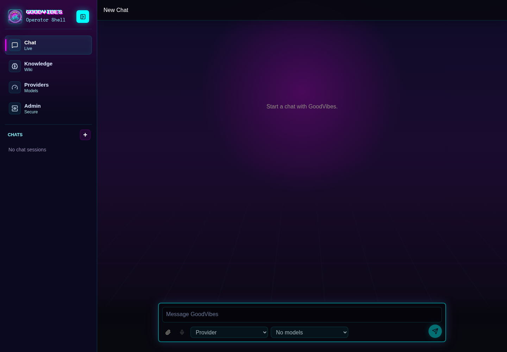
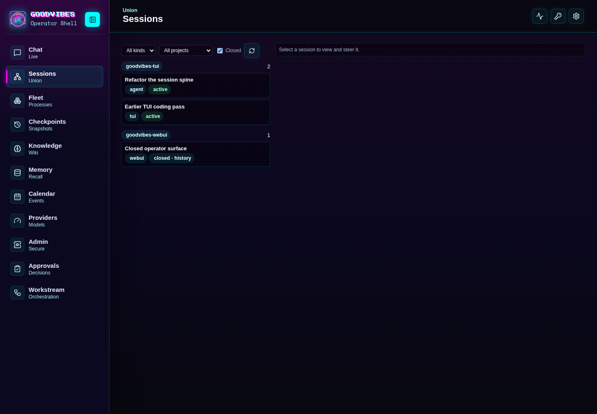
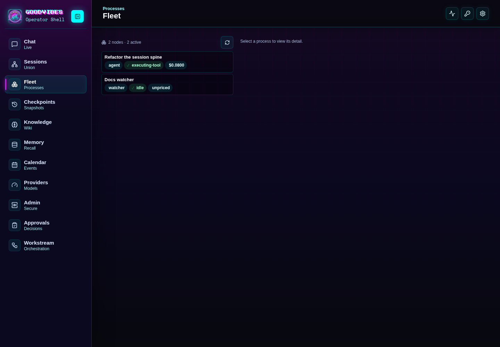
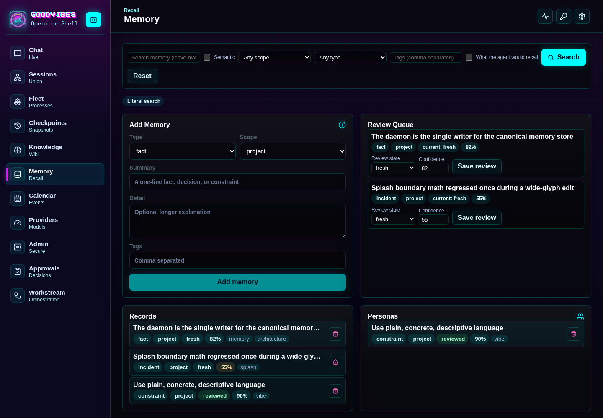
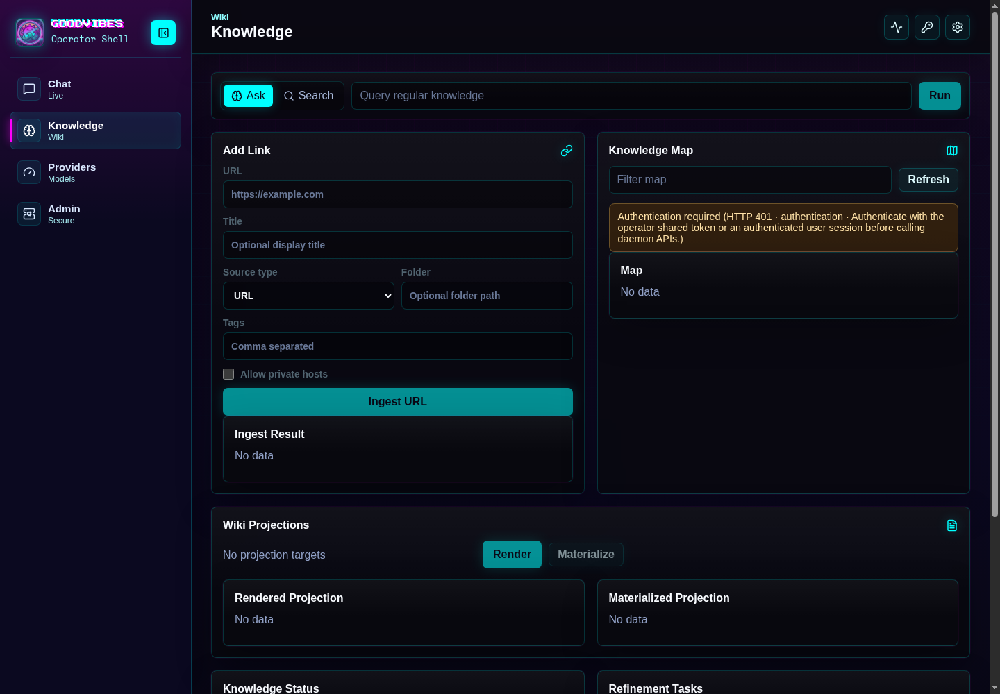
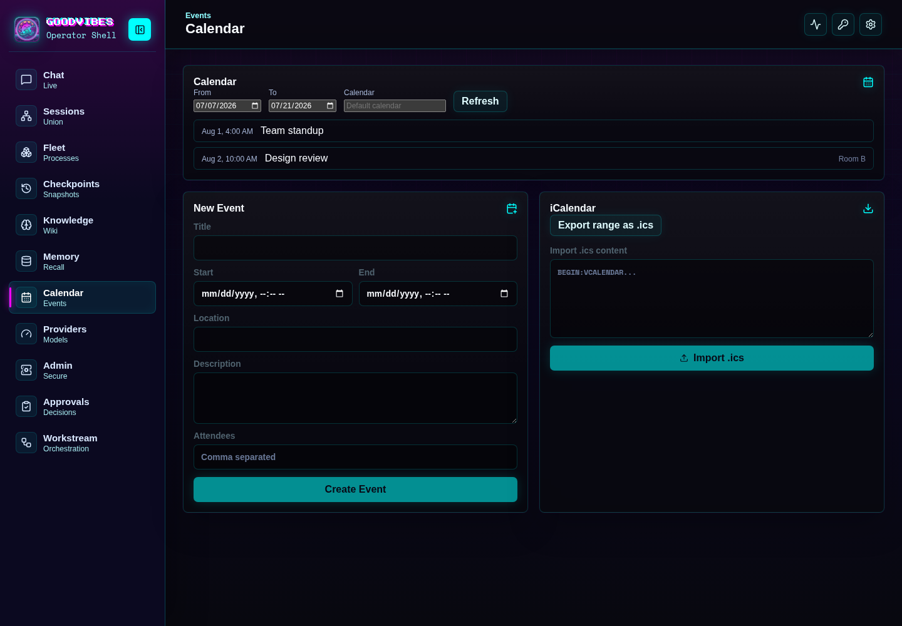
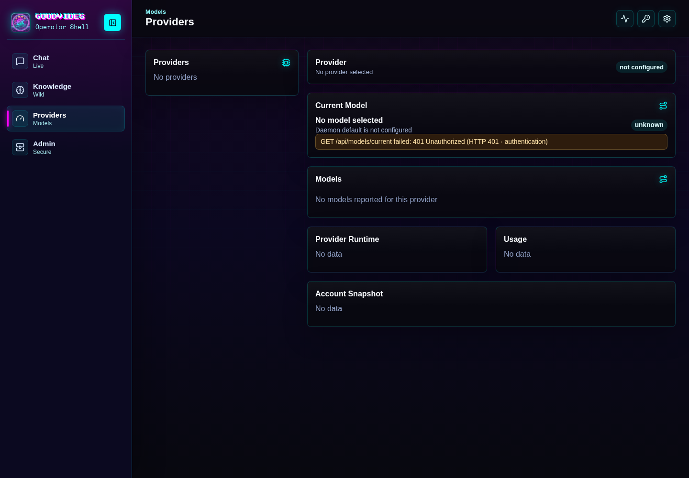
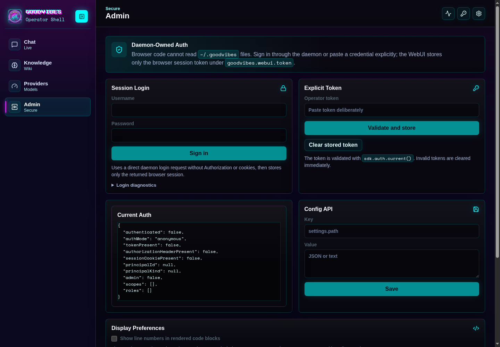

# GoodVibes WebUI

[](https://github.com/mgd34msu/goodvibes-webui/actions/workflows/ci.yml)


GoodVibes WebUI is the browser surface for the GoodVibes daemon: a full chat
application and operator console with feature parity across most of the
terminal UI's surface. One app serves desktop and phone — the phone gets a
drawer-based layout of the same views, never a different mental model — and it
installs from the browser as a standalone app (add to home screen, offline
shell, push notifications).

The application is intentionally thin over the published GoodVibes SDK. Browser
code uses the public scoped SDK seams from npm (typed contracts, no hand-typed
wire shapes) and talks to the daemon through the configured WebUI origin and
Vite proxy during development, or same-origin when the daemon serves the built
bundle itself.

## Stack

- Bun
- Vite
- React
- TypeScript
- TanStack Query
- `@pellux/goodvibes-sdk`
- `react-markdown`, `remark-gfm`, `remark-breaks`, and `highlight.js` for
  assistant/knowledge Markdown rendering
- Playwright (phone + desktop end-to-end suites against a hermetic mock daemon)

## Documentation

- [Screenshot Tour](docs/screenshot-tour.md): current WebUI layout captures.
- [Architecture](docs/architecture.md): runtime topology, SDK boundaries, state,
  and route ownership.
- [Operator Guide](docs/operator-guide.md): what each WebUI surface is for and
  the expected user workflows.
- [Development](docs/development.md): local setup, environment variables,
  network binding, validation, and repo conventions.
- [Deployment](docs/deployment.md): reaching the app from another machine over
  Tailscale, same-origin bundle serving, installing the app (add-to-home-screen),
  honest offline, and Web Push notifications.
- [SDK Surface Matrix](docs/sdk-surface-matrix.md): public SDK/daemon surfaces
  the WebUI is expected to use.
- [SDK Update Checklist](docs/sdk-update-checklist.md): exact steps for routine
  SDK bumps.
- [Security Notes](docs/security.md): auth, network, token, and artifact
  handling boundaries.
- [Known Limitations](docs/known-limitations.md): intentional gaps and current
  constraints.
- [Troubleshooting](docs/troubleshooting.md): common auth, network, chat,
  provider/model, and Vite-cache failures.
- [Changelog](CHANGELOG.md): semver history and release notes.

## Screenshots

Captured from the dev server against the end-to-end suite's seeded mock daemon
at 1440x1000, dark theme. Live daemon data, auth state, and provider inventory
will vary.

| Chat | Sessions |
| --- | --- |
|  |  |

| Fleet | Memory |
| --- | --- |
|  |  |

| Knowledge | Calendar |
| --- | --- |
|  |  |

| Providers | Admin |
| --- | --- |
|  |  |

## Quick Start

Prerequisites:

- Bun `1.3.14`
- A running GoodVibes daemon
- An installed `goodvibes` CLI when running standalone development, so Vite can
  resolve the configured WebUI binding with `goodvibes web --json`

Install and run:

```bash
bun install
bun run dev
```

The browser app runs on the GoodVibes web surface port. The default local URL is:

```bash
http://127.0.0.1:3423/
```

Use the URL printed by Vite after startup as the source of truth for the current
bind address. For production use, the daemon can serve the built bundle
same-origin — see [docs/deployment.md](docs/deployment.md).

## Runtime Topology

The daemon/control-plane API is canonical on port `3421`. The WebUI browser
surface is canonical on port `3423`.

In development, Vite:

- binds to the TUI-resolved WebUI host and port
- proxies same-origin `/api/*`, `/login`, `/status`, `/task`, and `/config`
  requests to the daemon/control-plane origin
- supports WebSocket upgrades for proxied control-plane routes
- uses `strictPort: true` so it fails loudly instead of silently moving ports

Binding precedence:

1. Explicit launch environment from TUI/daemon:
   `GOODVIBES_WEB_HOST`, `GOODVIBES_WEB_PORT`, and
   `GOODVIBES_DAEMON_BASE_URL`
2. One-off development overrides:
   `VITE_GOODVIBES_WEBUI_HOST`, `VITE_GOODVIBES_WEBUI_PORT`, and
   `VITE_GOODVIBES_BACKEND_URL`
3. `goodvibes web --json`
4. TUI settings file fallback for dev bootstrap only

Do not make browser code read `~/.goodvibes` files. Those files are daemon/TUI
implementation state.

## Auth

Browser auth is daemon-owned.

- Username/password login goes through the daemon login route.
- Explicit operator tokens may be pasted by the user and validated against the
  daemon.
- The browser token store key is `goodvibes.webui.token`.
- The WebUI does not scrape bootstrap credentials, operator token files, or any
  `~/.goodvibes` auth files.

## Main Surfaces

- **Chat**: daemon-owned companion chat — streaming markdown with highlighted
  code blocks, searchable history sidebar, rich composer with attachments,
  regenerate and edit-with-branching (superseded turns stay viewable),
  automatic titles, stop-generation, and an artifacts slide-over.
- **Sessions**: the cross-surface session union — find any session started from
  the terminal, agent, or browser; read its transcript; steer it (plain Enter
  sends on a phone) or follow up when it's closed, labeled honestly.
- **Fleet**: the live process tree with per-agent state, steer/detach/stop
  where the wire genuinely supports them, and inline approvals (per-hunk on
  wide screens).
- **Checkpoints**: browse, create, restore, and diff checkpoint-to-checkpoint.
- **Knowledge**: the regular Knowledge/Wiki — consolidation candidates with a
  review gate, the prompt-packet builder with truncation disclosure, and the
  activity map. Home Assistant Home Graph is intentionally not part of this
  surface (see below).
- **Memory**: browse and search the shared cross-surface memory store with the
  recall-honesty details rendered verbatim (search mode, index availability,
  exclusion counts), review-state edits, and true deletion with proof-of-gone.
- **Calendar**: agenda from the daemon's calendar module with ICS
  import/export; an unconfigured daemon shows the bring-your-own-CalDAV note,
  never a fake-empty calendar.
- **Voice**: spoken replies (batched, concurrency-capped synthesis) and
  microphone dictation over the daemon's speech-to-text with
  review-before-send; one voice configuration shared across terminal, desktop,
  and agent.
- **Providers / Models**: provider status pills driven by the daemon's own
  route freshness, and a multi-target model workspace.
- **Approvals / Tasks / Workstream**: decision queues and orchestration state.
- **Admin**: auth, daemon diagnostics, config with secret redaction, display
  preferences, notifications-and-install (Web Push subscribe lives here).

Home Assistant Home Graph is not part of the general Knowledge/Wiki surface.
Do not call Home Graph routes or add WebUI-side Home Graph filtering to the
regular Knowledge page. Regular Knowledge scoping is owned upstream by the
daemon/SDK.

## Console UX

The operator console layer that wraps the surfaces above:

- **⌘K command palette** — fuzzy-search and invoke any action from the
  keyboard, with global hotkeys and a shortcut cheatsheet overlay.
- **Daemon pulse strip** — a persistent status strip showing connection state,
  round-trip latency, live-update health, and active-work count; connected /
  reconnecting / down transitions are visible without opening Admin.
- **URL deep-linking** — sessions, views, and slide-over peek targets are
  addressable by URL and survive refresh.
- **Honest degraded states** — a dropped stream, an unreachable daemon, an
  expired token, and a filtered-empty list each say exactly what they are,
  with retry where retry is real. Cached data is never dressed up as live.
- **Theming and density** — dark-first semantic token system
  (`src/styles/tokens.css`, generated from the SDK's shared presentation
  contract), compact/default/comfortable density, and full
  `prefers-reduced-motion` support.
- **Accessibility** — full keyboard navigation with roving focus, `aria-live`
  announcements, focus-trapped modals/palette/slide-over, and 44px touch
  targets at phone width.

## Verification

Run the same sequence GitHub Actions runs:

```bash
bun run ci        # test, typecheck, build
bun run lint
bun run e2e       # Playwright, phone + desktop, hermetic mock daemon
```

GitHub Actions runs three blocking jobs on every push and pull request to
`main`: test/typecheck/build (plus the SDK pin/lock/import release gates),
lint, and the end-to-end suite. All three must pass — no advisory jobs
(ruling: [docs/decisions/2026-07-07-e2e-ci-in-ci.md](docs/decisions/2026-07-07-e2e-ci-in-ci.md)).

## Release Notes

This repo uses semantic versioning with `vMAJOR.MINOR.PATCH` git tags. Every
shipped change should update:

- `package.json` version
- `CHANGELOG.md`
- the WebUI/SDK/Bun badges at the top of this README
- `index.html` favicon/cache-bust query string when the app version changes

For SDK bumps, follow [docs/sdk-update-checklist.md](docs/sdk-update-checklist.md).
