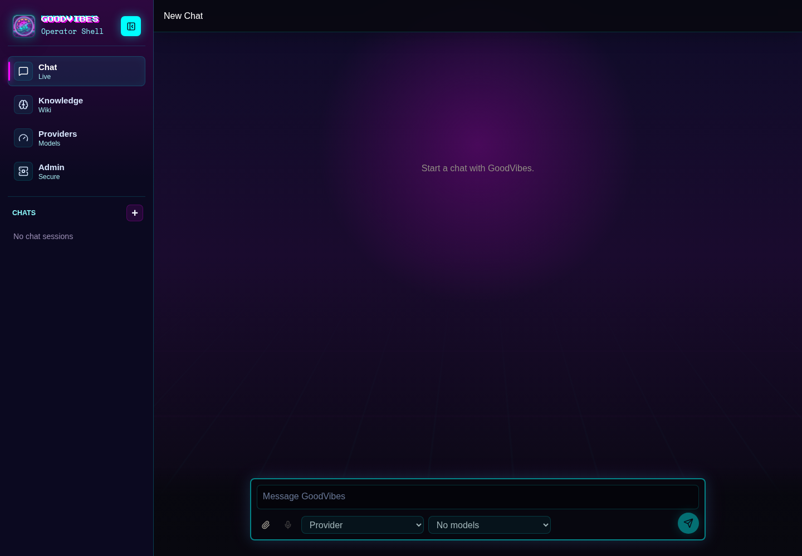
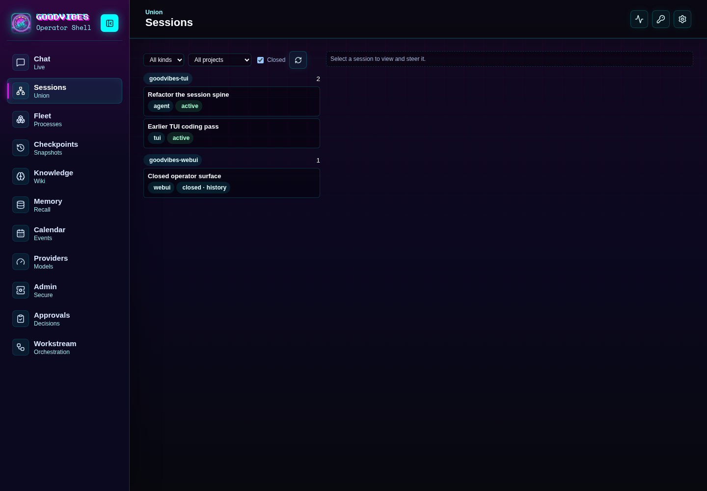
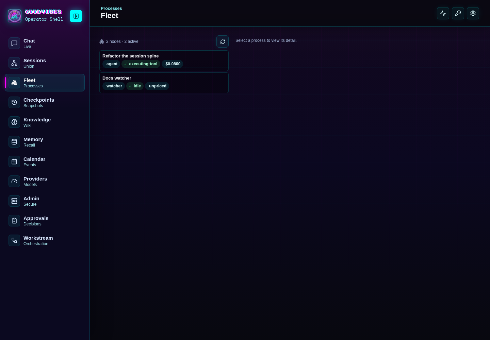
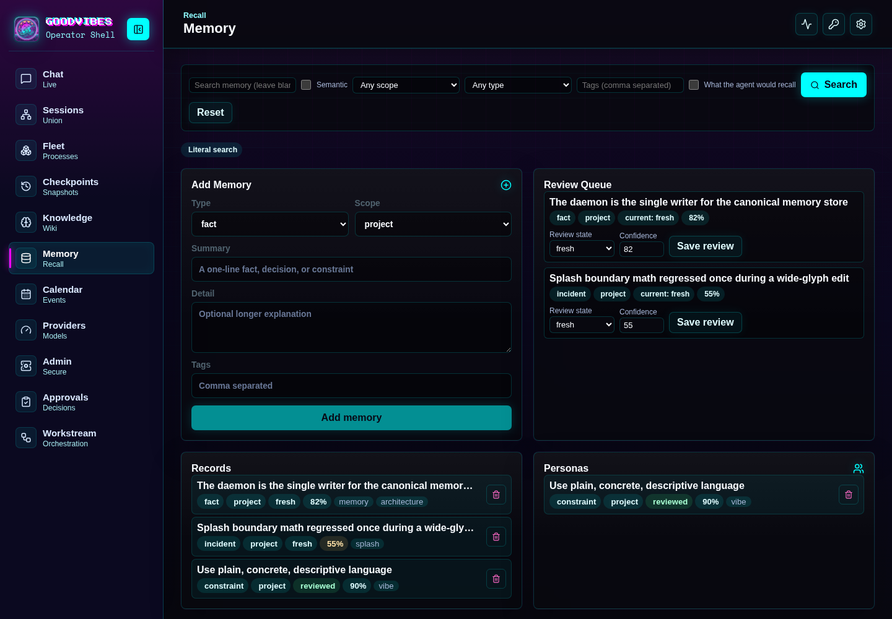
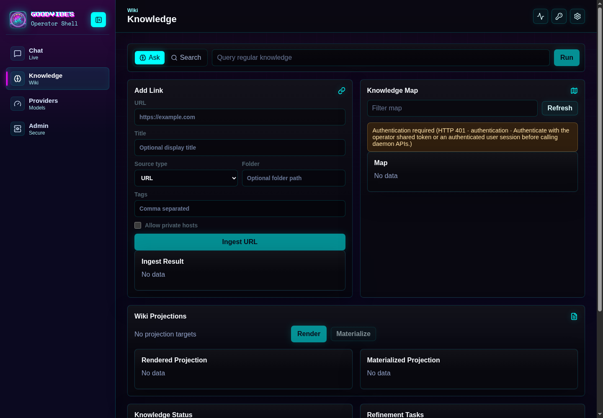
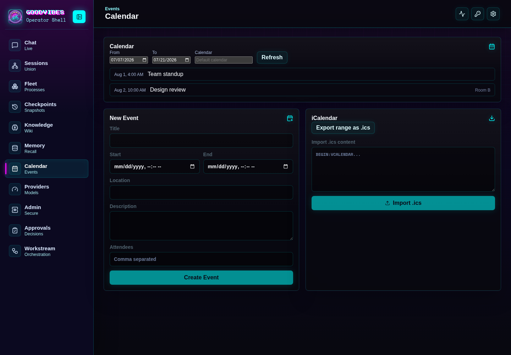
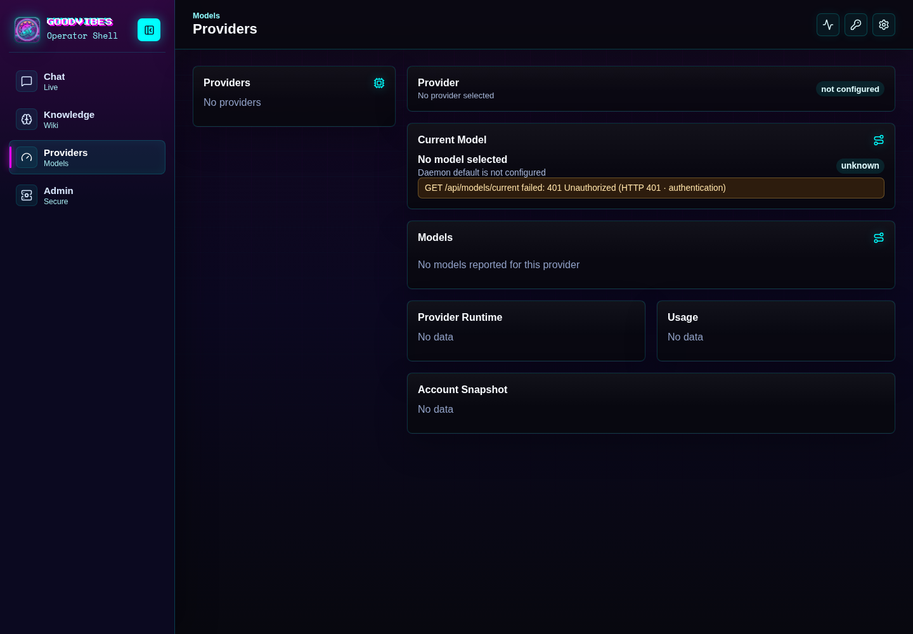
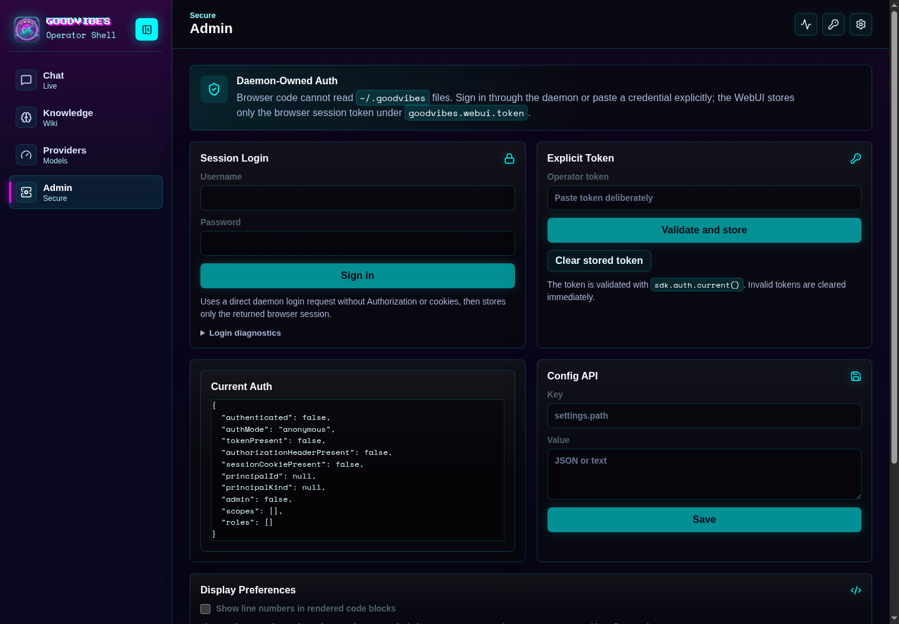

# GoodVibes WebUI

[](https://github.com/mgd34msu/goodvibes-webui/actions/workflows/ci.yml)


GoodVibes WebUI is the browser surface for a GoodVibes daemon, a full chat
application and operator console with feature parity across most of the
terminal UI's surface. One app serves desktop and phone. The phone gets a
drawer-based layout of the same views, never a different mental model, and it
installs from the browser as a standalone app (add to home screen, offline
shell, push notifications).

It does not need to run on the same machine as the daemon. Point it at a
daemon behind a Tailscale HTTPS hostname on your tailnet, which is the path
the installable app, offline shell, and Web Push are built around, or at a
daemon on the same local network with firewall policy allowing the connection.
When neither reaches the daemon directly, a stored relay pairing tunnels
requests end to end encrypted through a rendezvous relay. All three are
covered in [docs/deployment.md](docs/deployment.md). In production the
daemon can also serve the built WebUI bundle itself, same-origin, so the
browser and the API share one address and there is no cross-origin setup at all.

The application is intentionally thin over the published GoodVibes SDK. Browser
code uses the public scoped SDK seams from npm (typed contracts, no hand-typed
wire shapes), plus the generated route table from the published
`@pellux/goodvibes-contracts` package, and talks to the daemon through the
configured WebUI origin and Vite proxy during development, or same-origin when
the daemon serves the built bundle itself.

Stack: Bun, Vite, React, TypeScript, TanStack Query, `@pellux/goodvibes-sdk`,
`react-markdown`/`remark-gfm`/`remark-breaks`/`highlight.js` for chat and
Knowledge Markdown rendering, `jsqr` as the pairing scanner's fallback QR
decoder, `onnxruntime-web` for in-tab wake-word inference, and Playwright for
the phone + desktop end-to-end suites against a hermetic mock daemon.

---

## Quick start

Prerequisites:

- Bun `1.3.14`
- A running GoodVibes daemon, reachable locally or over the network
- For standalone development, Vite resolves the configured WebUI binding by
  asking the daemon directly (`goodvibes-daemon webui status --json`, once an
  installed daemon answers it), falling back to the terminal's own
  `goodvibes web --json` / `~/.goodvibes/tui/settings.json` on an older daemon

```bash
bun install
bun run dev
```

Use the URL Vite prints after startup as the source of truth for the bind
address. The default local URL is `http://127.0.0.1:3423/`. The daemon/
control-plane API is canonical on port `3421`. In development, Vite proxies
`/api/*`, `/login`, `/status`, `/task`, and `/config` (including WebSocket
upgrades) to it, with `strictPort: true` so a port conflict fails loudly
instead of silently moving ports. For running the daemon and reaching it from
another machine, see [docs/deployment.md](docs/deployment.md) and
[docs/development.md](docs/development.md).

---

## A tour of the surfaces

Screenshots are captured from the dev server against the end-to-end suite's
seeded mock daemon at 1440×1000, dark theme. They prove layout, not live
daemon data, auth state, or provider inventory. The full walkthrough, one
surface at a time (including a collapsed-sidebar layout), is
[docs/screenshot-tour.md](docs/screenshot-tour.md).

| Chat | Sessions |
| --- | --- |
|  |  |

| Fleet | Memory |
| --- | --- |
|  |  |

| Knowledge | Calendar |
| --- | --- |
|  |  |

| Providers | Admin |
| --- | --- |
|  |  |

Chat is the primary workspace; the rest are operator surfaces over the same
daemon state the terminal UI uses.

---

## What's in the box

Each row links to the page that documents it in depth. `?`-style in-app help
does not exist here yet. These docs and the Admin diagnostics view are the
current authority.

| Surface | What you get | Docs |
| --- | --- | --- |
| Chat | Daemon-owned companion chat: streaming markdown, searchable history, attachments, regenerate and edit-with-branching (superseded turns stay viewable), automatic titles, stop-generation with a server-side cancel, mid-turn steering, an artifacts slide-over | [operator-guide.md](docs/operator-guide.md) |
| Sessions | The cross-surface session union: find, read, steer, or follow up on any session started from the terminal, agent, or browser, with per-session permission mode, context usage, cost, rewind, and per-hunk change review | [operator-guide.md](docs/operator-guide.md) |
| Hosted sessions | Daemon-hosted sessions whose loop runs inside the daemon, so they survive the tab: list, create, attach, steer, leave, or end them | [operator-guide.md](docs/operator-guide.md) |
| Fleet | The live process tree with per-agent state, steer/detach/stop where the wire supports them, and inline approvals (per-hunk on wide screens) | [operator-guide.md](docs/operator-guide.md) |
| Checkpoints | Browse, create, restore, and diff checkpoint-to-checkpoint | [operator-guide.md](docs/operator-guide.md) |
| Knowledge/Wiki | The regular Knowledge surface: ask, search, sources/nodes/issues/maps, projections and ingest where the SDK exposes them. Home Assistant Home Graph is deliberately not part of this page | [operator-guide.md](docs/operator-guide.md) |
| Memory | Browse and search the shared cross-surface memory store, recall-honesty details rendered verbatim, review-state edits, and true (verified) deletion | [operator-guide.md](docs/operator-guide.md) |
| Calendar | Agenda from the daemon's calendar module with ICS import/export; an unconfigured daemon shows a bring-your-own-CalDAV note, never a fake-empty calendar | [operator-guide.md](docs/operator-guide.md), [known-limitations.md](docs/known-limitations.md) |
| Voice | Batched spoken replies, microphone dictation over the daemon's speech-to-text with review-before-send, and opt-in wake-word listening that runs its detector inside the tab; one voice configuration shared across terminal, desktop, and agent | [operator-guide.md](docs/operator-guide.md) |
| Mail | Inbox, message reader, and composer over the daemon's `email.*` verbs; a daemon without a mail handler gets an honest not-available state, never a fake-empty inbox | [operator-guide.md](docs/operator-guide.md) |
| Dates | Occasions and plans over the daemon's `occasions.*` verbs: upcoming dates, pending questions, and gift history, with every rule computed server-side | [operator-guide.md](docs/operator-guide.md) |
| CI | Standing CI watches plus ad hoc repo/ref/PR status checks, with every job's own conclusion listed, never a bare rollup badge | [operator-guide.md](docs/operator-guide.md) |
| Check-in | The proactive check-in configuration, a run-now trigger, and per-run receipts that state each outcome plainly | [operator-guide.md](docs/operator-guide.md) |
| Principals | The named-identity registry and per-channel profile bindings that decide who a channel message resolves to | [operator-guide.md](docs/operator-guide.md) |
| Phone | This browser acting as a paired device node: camera, screen, location, clipboard, and device commands served to the agent, every capture confirmed with the person first | [operator-guide.md](docs/operator-guide.md) |
| Providers / Models | Provider status pills driven by the daemon's own route freshness, and a provider-first model workspace | [operator-guide.md](docs/operator-guide.md) |
| Approvals / Tasks / Workstream | Decision queues and orchestration state, plus push-notification action buttons that hand off to an authenticated in-app decision | [operator-guide.md](docs/operator-guide.md), [push-approval-actions.md](docs/push-approval-actions.md) |
| Admin | Auth, daemon diagnostics, the schema-driven settings surface with secret redaction, display preferences, notifications-and-install (Web Push subscribe lives here), pairing tokens, passkey step-up, and power/memory posture | [operator-guide.md](docs/operator-guide.md) |
| Sign-in and pairing | Scan the QR from `goodvibes pair` (or open its link) to sign in without copy/paste; hand-off bundles can also offer push, relay, and passkey setup in one step | [operator-guide.md](docs/operator-guide.md), [security.md](docs/security.md) |
| Console UX | ⌘K command palette with global hotkeys, a persistent daemon pulse strip, URL deep-linking, honest degraded states, dark-first theming with density modes, and full keyboard/`aria-live`/focus-trap accessibility | [architecture.md](docs/architecture.md) |
| Install and push | Add-to-home-screen install, a cached app shell with honest offline (no API response is ever cached), and Web Push for approvals/completions | [deployment.md](docs/deployment.md) |
| Architecture | Runtime topology, the SDK boundary, state ownership, and route ownership | [architecture.md](docs/architecture.md) |
| Auth and network | The daemon-owned trust boundary, token storage, and network binding rules | [security.md](docs/security.md) |
| Known limitations | Intentional gaps and current constraints, so they aren't mistaken for hidden contracts | [known-limitations.md](docs/known-limitations.md) |
| SDK surface matrix | The exact public SDK/daemon methods each surface uses, plus explicit non-surfaces | [sdk-surface-matrix.md](docs/sdk-surface-matrix.md) |
| Troubleshooting | Common auth, network, chat, provider/model, and Vite-cache failures with recovery steps | [troubleshooting.md](docs/troubleshooting.md) |

---

## Configuration

There is no user-facing WebUI settings file. The daemon owns configuration
and auth, and the browser only caches UI preferences and recent-session ids,
never as a durable source of truth. What you can set:

| Setting | Where | What it does |
| --- | --- | --- |
| `GOODVIBES_WEB_HOST` / `GOODVIBES_WEB_PORT` | Launch environment (TUI/daemon) | Resolved Vite bind host/port |
| `GOODVIBES_DAEMON_BASE_URL` | Launch environment | Daemon/control-plane backend URL |
| `VITE_GOODVIBES_WEBUI_HOST` / `VITE_GOODVIBES_WEBUI_PORT` | One-off dev override | Vite bind host/port for a single run |
| `VITE_GOODVIBES_BACKEND_URL` | One-off dev override | Development proxy target |
| `VITE_GOODVIBES_BASE_URL` | One-off dev override | Bypass same-origin proxying entirely |
| Theme, density | Admin → display preferences, browser `localStorage` | Dark-first token system, compact/default/comfortable density |
| Operator token | Scanned or pasted at the sign-in screen (or in Admin), `localStorage` key `goodvibes.webui.token` | Browser-held auth token, validated against the daemon |

The full binding precedence order and remaining one-off variables are in
[docs/development.md](docs/development.md). Auth, token custody, and the files
the browser must never read are in [docs/security.md](docs/security.md).

---

## Development

```bash
git clone https://github.com/mgd34msu/goodvibes-webui.git
cd goodvibes-webui
bun install
bun run dev
```

| Command | Does |
| --- | --- |
| `bun run dev` | Run the WebUI against a configured/resolved daemon |
| `bun run test:changed` | The unit test files affected by changes since `origin/main` |
| `bun run test` | The whole unit suite (Bun, isolated) |
| `bun run typecheck` | `tsc` over `src/`, `scripts/` and `e2e/` |
| `bun run build` | `vite build` |
| `bun run lint` | ESLint over the whole tree |
| `bun run e2e:phone` | Playwright's phone project against the hermetic mock daemon (`e2e/support/mock-daemon.ts`) |
| `bun run e2e` | Every Playwright project (phone, desktop, lan-origin) |
| `bun run release:prepare` | Version bump plus everything derived from it or from the SDK |

GitHub Actions runs typecheck, lint, one unit run, the build with the SDK pin
agreement, and Playwright's phone project on every push and pull request to
`main`; the desktop and lan-origin projects run before a release and nightly
([docs/testing-and-validation.md](docs/testing-and-validation.md)). No job
runs with `continue-on-error`. A red job reds the run
(ruling: [docs/decisions/2026-07-07-e2e-ci-in-ci.md](docs/decisions/2026-07-07-e2e-ci-in-ci.md)).
A green push-CI run on `main` is the only release gate. The workflow tags the
commit and opens a GitHub Release with notes cut from `CHANGELOG.md`. The
release carries two assets, the built bundle tarball
(`goodvibes-webui-bundle-<version>.tar.gz`) and its `SHA256SUMS.txt` manifest,
which the suite installer fetches and verifies so a daemon can serve the
bundle same-origin without building it locally.

Coding rules worth knowing before you read the source:

- Import browser code from the published `@pellux/*` npm packages only, never
  a local SDK checkout, never deep reaches into `dist/`. A test resolves every
  imported subpath against the installed packages, and the build refuses to
  ship while the local SDK overlay (`bun run sdk:link`) is active.
- Keep canonical state in the daemon. Browser storage is cache/preferences
  only, and it must never read `~/.goodvibes/**` files.
- Presentation tokens (`src/styles/tokens.css`) are generated from the SDK's
  shared presentation contract by `scripts/generate-presentation-tokens.ts`,
  never hand-edited.
- Operator methods without a dedicated SDK helper ride the generic typed
  invoke path, typed from the SDK's generated contract maps
  (`src/lib/contract-bridge-types.ts`), no hand-typed wire shapes.
- Do not add Home Assistant Home Graph filtering to the regular
  Knowledge/Wiki surface.

Source layout, in brief:

```text
src/
├── App.tsx, main.tsx        app shell, routing, top-level composition
├── lib/                      SDK facade, chat/session helpers, theme, push, pairing, generated tokens
├── views/                    one directory per operator surface (chat, sessions, fleet, memory, calendar, ...)
├── components/                command palette, modals, toasts, diff, fleet widgets, motion, settings
├── hooks/                     shared React hooks
└── styles/                    token CSS and per-component stylesheets
```

For routine SDK version bumps, follow
[docs/sdk-update-checklist.md](docs/sdk-update-checklist.md).

---

## Stability

This repo is not published to npm by design. It is versioned with semantic
`vMAJOR.MINOR.PATCH` git tags. A green CI run on `main` tags the commit and
opens a GitHub Release whose notes are cut from `CHANGELOG.md`, with the built
bundle tarball and its checksum manifest attached for the suite installer.
Run it from `bun install` + `bun run build`, or let a daemon serve the built
bundle same-origin. Every shipped change runs `bun run release:prepare`,
which updates `package.json`, `CHANGELOG.md`, the version badges above, and
`index.html`'s cache-bust query string. Documentation always describes the **current** behavior, not
historical behavior. See [CHANGELOG.md](CHANGELOG.md) for history.

## License

MIT. See [LICENSE](LICENSE); `package.json` declares the matching `license`
field.
