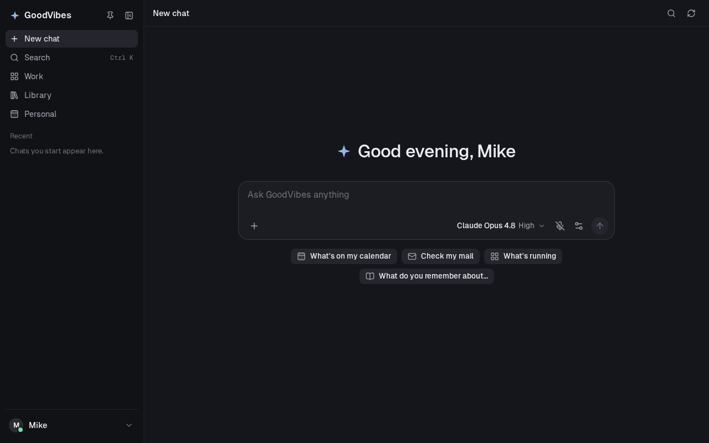
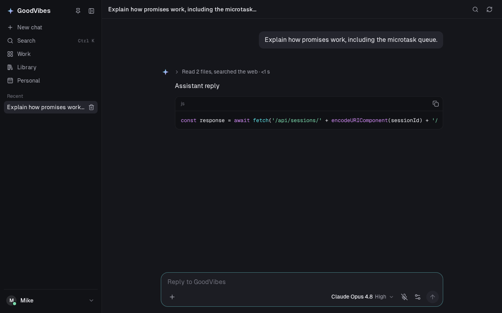
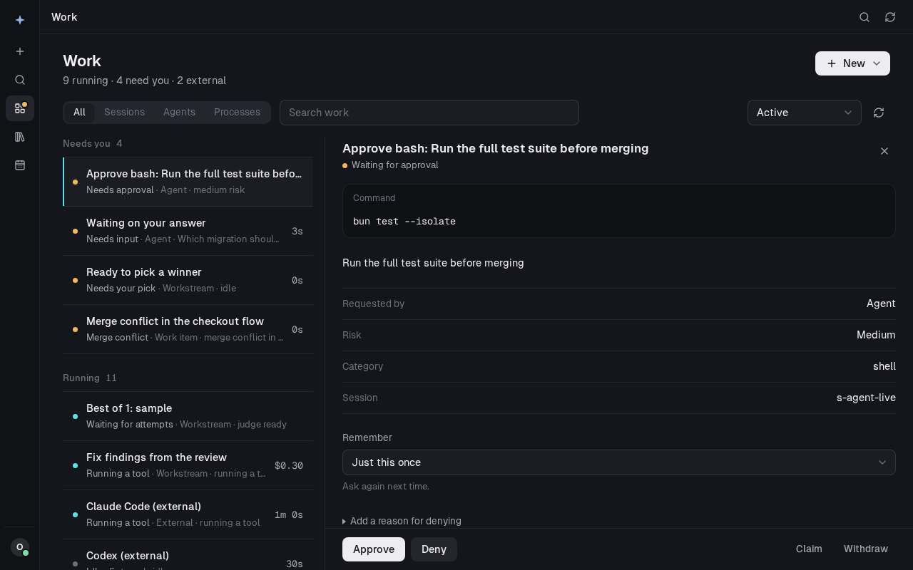
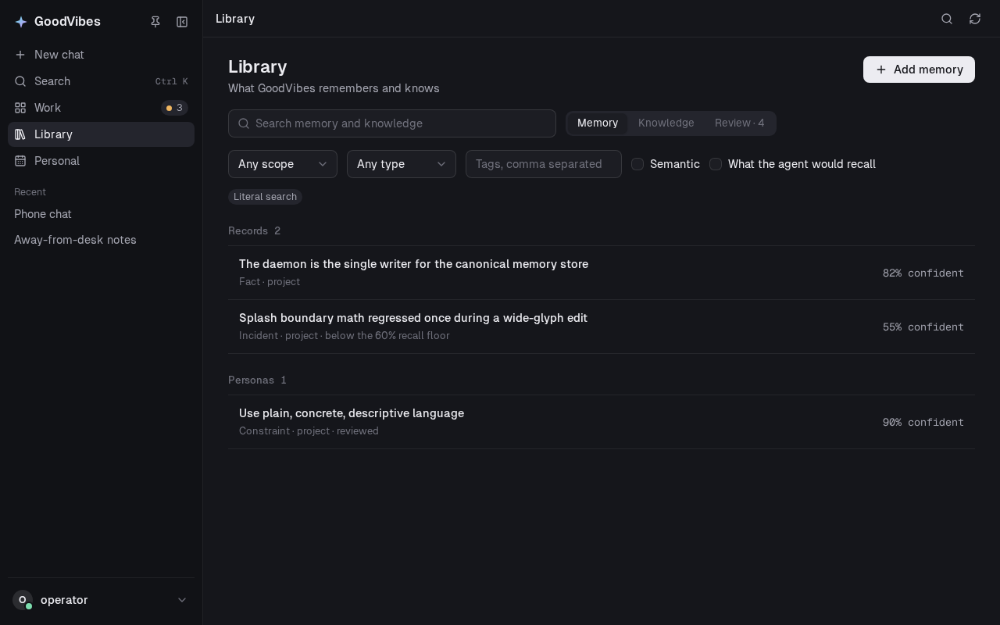
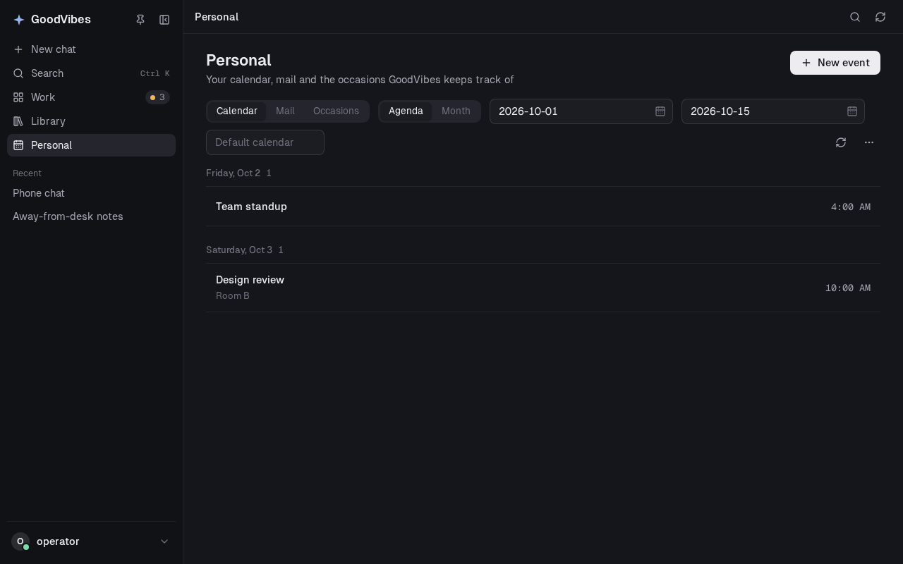
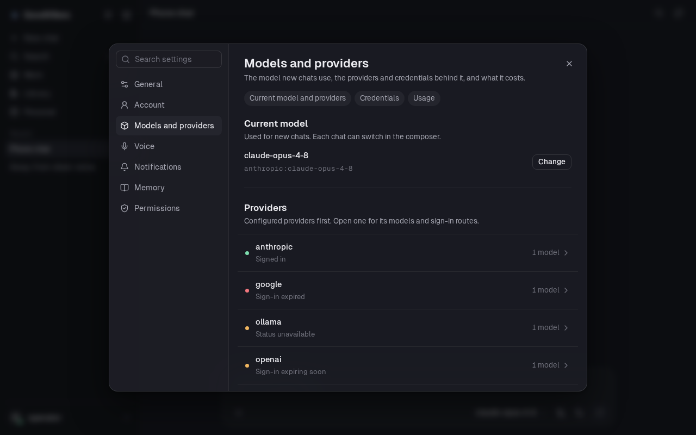
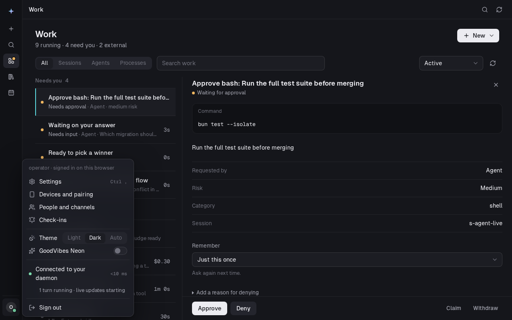
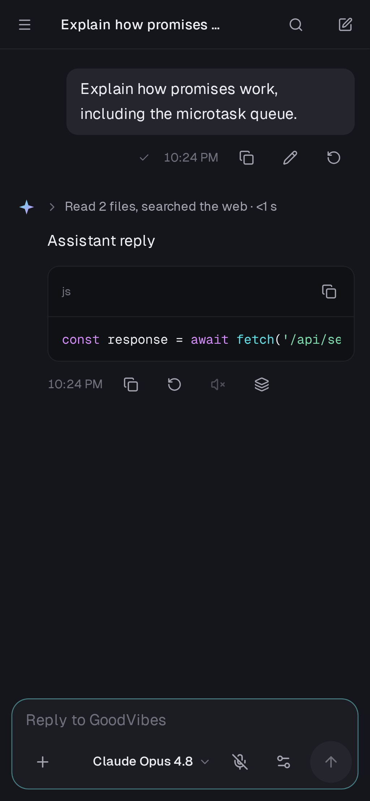
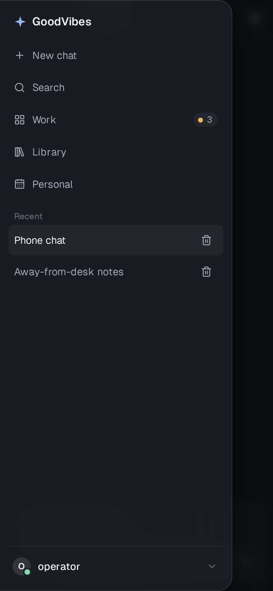
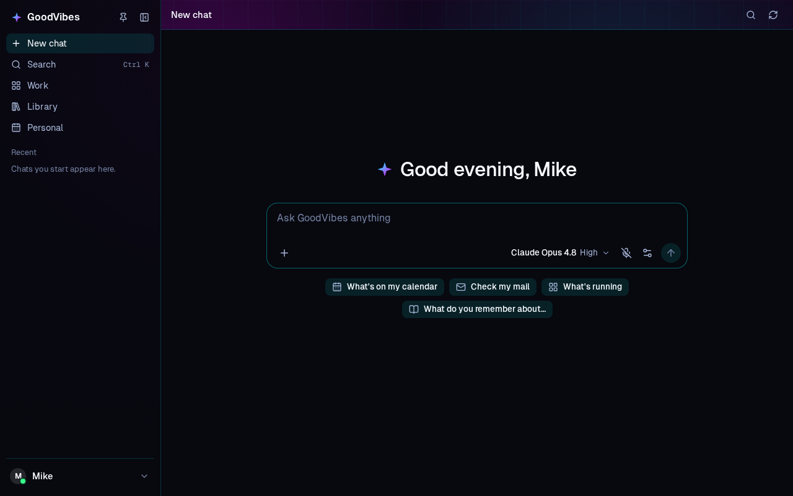

# GoodVibes WebUI

[](https://github.com/mgd34msu/goodvibes-webui/actions/workflows/ci.yml)


GoodVibes WebUI is the browser app for a GoodVibes daemon: a chat application
for talking to your models, and a place to see and steer everything your
daemon is doing. One app serves desktop and phone. The phone gets a drawer
layout of the same four places, never a different mental model, and it
installs from the browser as a standalone app (add to home screen, offline
shell, push notifications).

It does not need to run on the same machine as the daemon. Point it at a
daemon behind a Tailscale HTTPS hostname on your tailnet, which is the path
the installable app, offline shell, and Web Push are built around, or at a
daemon on the same local network with firewall policy allowing the connection.
When neither reaches the daemon directly, a stored relay pairing tunnels
requests end to end encrypted through a rendezvous relay. All three are
covered in [docs/deployment.md](docs/deployment.md). In production the
daemon can also serve the built WebUI bundle itself, same-origin, so the
browser and the API share one address and there is no cross-origin setup at all.

The application is intentionally thin over the published GoodVibes SDK. Browser
code uses the public scoped SDK seams from npm (typed contracts, no hand-typed
wire shapes), plus the generated route table from the published
`@pellux/goodvibes-contracts` package, and talks to the daemon through the
configured WebUI origin and Vite proxy during development, or same-origin when
the daemon serves the built bundle itself.

Stack: Bun, Vite, React, TypeScript, TanStack Query, `@pellux/goodvibes-sdk`,
`react-markdown`/`remark-gfm`/`remark-breaks`/`highlight.js` for chat and
Knowledge Markdown rendering, `jsqr` as the pairing scanner's fallback QR
decoder, `onnxruntime-web` for in-tab wake-word inference, and Playwright for
the phone + desktop end-to-end suites against a hermetic mock daemon.

---

## Quick start

Prerequisites:

- Bun `1.3.14`
- A running GoodVibes daemon, reachable locally or over the network
- For standalone development, Vite resolves the configured WebUI binding by
  asking the daemon directly (`goodvibes-daemon webui status --json`, once an
  installed daemon answers it), falling back to the terminal's own
  `goodvibes web --json` / `~/.goodvibes/tui/settings.json` on an older daemon

```bash
bun install
bun run dev
```

Use the URL Vite prints after startup as the source of truth for the bind
address. The default local URL is `http://127.0.0.1:3423/`. The daemon/
control-plane API is canonical on port `3421`. In development, Vite proxies
`/api/*`, `/login`, `/status`, `/task`, and `/config` (including WebSocket
upgrades) to it, with `strictPort: true` so a port conflict fails loudly
instead of silently moving ports. For running the daemon and reaching it from
another machine, see [docs/deployment.md](docs/deployment.md) and
[docs/development.md](docs/development.md).

---

## A tour

GoodVibes has four places, listed in the sidebar: Chat, Work, Library and
Personal. Everything else (settings, devices, sign-in, models) lives in a
settings dialog and an account menu. Screenshots are captured against the
end-to-end suite's seeded mock daemon, so they prove layout, not live daemon
data, auth state, or provider inventory. The full walkthrough is
[docs/screenshot-tour.md](docs/screenshot-tour.md).

### Chat

A new chat opens on a greeting, one composer, and a few starting points. Your
chats are listed under Recent in the sidebar, newest first. Replies stream with
syntax-highlighted Markdown, tool activity folds into one quiet line, and the
composer holds attachments, the model picker and voice.

| New chat | A conversation |
| --- | --- |
|  |  |

### Work

Everything running for you in one list: sessions from the terminal, agent and
browser, agents and processes, approvals, tasks and CI watches. What needs you
comes first, with the item open beside the list so you can decide in place.
When a detail is open the sidebar folds to an icon rail to give it room.



### Library

What GoodVibes remembers and knows: Memory, Knowledge, and a Review list of
everything waiting on a human call. Memory shows how confident each record is
and, for search, which mode actually ran.



### Personal

Your calendar, mail and the occasions GoodVibes keeps track of. A daemon
without a calendar or mail account says so instead of showing an empty page.



### Settings and the account menu

Settings is a dialog with seven pages: General, Account, Models and providers,
Voice, Notifications, Memory and Permissions, with search across them. Open it
from the account menu at the foot of the sidebar, or with Ctrl comma. The
account menu also holds devices and pairing, people and channels, check-ins,
the theme, your connection to the daemon in plain words, and Sign out.

| Settings, Models and providers | The account menu |
| --- | --- |
|  |  |

### On a phone

The same four places, with the sidebar as a drawer behind the header's menu
button or a swipe from the left edge.

| A conversation | The drawer |
| --- | --- |
|  |  |

### Themes

GoodVibes follows your system light or dark setting, or you can pick one. For
a louder look there is GoodVibes Neon, an opt-in theme under Settings, General
or in the account menu. It never replaces a theme you chose.



---

## What's in the box

Each row links to the page that documents it in depth. These docs and Settings,
General, About are the current authority; there is no separate in-app help.

| Area | What you get | Docs |
| --- | --- | --- |
| Chat | Daemon-owned companion chat: streaming markdown, searchable history, attachments, regenerate and edit-with-branching (superseded turns stay viewable), automatic titles, stop-generation with a server-side cancel, mid-turn steering, an artifacts slide-over | [operator-guide.md](docs/operator-guide.md) |
| Work | One list of sessions (including daemon-hosted ones), agents and processes, approvals, tasks and CI watches, with Needs you first. Steer, approve per hunk, rewind, review changes, and browse and restore checkpoints | [operator-guide.md](docs/operator-guide.md), [push-approval-actions.md](docs/push-approval-actions.md) |
| Library | Memory (browse, search, verified deletion, recall details shown verbatim), Knowledge/Wiki (ask, search, sources, nodes, issues, maps; Home Assistant Home Graph is deliberately not part of it) and a Review list of consolidation proposals, the memory review queue and knowledge candidates | [operator-guide.md](docs/operator-guide.md) |
| Personal | Calendar with ICS import/export, Mail over the daemon's `email.*` verbs, and Occasions over its `occasions.*` verbs. A daemon without a handler gets an honest not-available state, never a fake-empty page | [operator-guide.md](docs/operator-guide.md), [known-limitations.md](docs/known-limitations.md) |
| Settings | Seven pages: General (theme, network, about), Account (sign-in, devices and pairing, people and channels), Models and providers (current model, credentials, usage), Voice, Notifications (push, install, check-ins), Memory and Permissions. Typed editors with secrets masked | [operator-guide.md](docs/operator-guide.md) |
| Voice | Batched spoken replies, microphone dictation over the daemon's speech-to-text with review-before-send, and opt-in wake-word listening that runs its detector inside the tab; one voice configuration shared across terminal, desktop, and agent | [operator-guide.md](docs/operator-guide.md) |
| Phone node | This browser acting as a paired device node: camera, screen, location, clipboard, and device commands served to the agent, every capture confirmed with the person first | [operator-guide.md](docs/operator-guide.md) |
| Sign-in and pairing | Scan the QR from `goodvibes pair` (or open its link) to sign in without copy/paste; hand-off bundles can also offer push, relay, and passkey setup in one step | [operator-guide.md](docs/operator-guide.md), [security.md](docs/security.md) |
| Shell | Ctrl K command palette, a sidebar that folds to a rail, an account menu showing connection state in plain words, URL deep-linking (older `?view=` links redirect), honest degraded states, light, dark and opt-in GoodVibes Neon themes, density modes, and keyboard, `aria-live` and focus-trap accessibility | [architecture.md](docs/architecture.md) |
| Install and push | Add-to-home-screen install, a cached app shell with honest offline (no API response is ever cached), and Web Push for approvals/completions | [deployment.md](docs/deployment.md) |
| Architecture | Runtime topology, the SDK boundary, state ownership, and route ownership | [architecture.md](docs/architecture.md) |
| Auth and network | The daemon-owned trust boundary, token storage, and network binding rules | [security.md](docs/security.md) |
| Known limitations | Intentional gaps and current constraints, so they aren't mistaken for hidden contracts | [known-limitations.md](docs/known-limitations.md) |
| SDK surface matrix | The exact public SDK/daemon methods each surface uses, plus explicit non-surfaces | [sdk-surface-matrix.md](docs/sdk-surface-matrix.md) |
| Troubleshooting | Common auth, network, chat, provider/model, and Vite-cache failures with recovery steps | [troubleshooting.md](docs/troubleshooting.md) |

---

## Configuration

There is no user-facing WebUI settings file. The daemon owns configuration
and auth, and the browser only caches UI preferences and recent-session ids,
never as a durable source of truth. What you can set:

| Setting | Where | What it does |
| --- | --- | --- |
| `GOODVIBES_WEB_HOST` / `GOODVIBES_WEB_PORT` | Launch environment (TUI/daemon) | Resolved Vite bind host/port |
| `GOODVIBES_DAEMON_BASE_URL` | Launch environment | Daemon/control-plane backend URL |
| `VITE_GOODVIBES_WEBUI_HOST` / `VITE_GOODVIBES_WEBUI_PORT` | One-off dev override | Vite bind host/port for a single run |
| `VITE_GOODVIBES_BACKEND_URL` | One-off dev override | Development proxy target |
| `VITE_GOODVIBES_BASE_URL` | One-off dev override | Bypass same-origin proxying entirely |
| Theme, density | Settings → General (or the account menu), browser `localStorage` | Light, dark or auto, the opt-in GoodVibes Neon theme, and compact/default/comfortable density |
| Operator token | Scanned or pasted at the sign-in screen (or in Settings → Account), `localStorage` key `goodvibes.webui.token` | Browser-held auth token, validated against the daemon |

The full binding precedence order and remaining one-off variables are in
[docs/development.md](docs/development.md). Auth, token custody, and the files
the browser must never read are in [docs/security.md](docs/security.md).

---

## Development

```bash
git clone https://github.com/mgd34msu/goodvibes-webui.git
cd goodvibes-webui
bun install
bun run dev
```

| Command | Does |
| --- | --- |
| `bun run dev` | Run the WebUI against a configured/resolved daemon |
| `bun run test:changed` | The unit test files affected by changes since `origin/main` |
| `bun run test` | The whole unit suite (Bun, isolated) |
| `bun run typecheck` | `tsc` over `src/`, `scripts/` and `e2e/` |
| `bun run build` | `vite build` |
| `bun run lint` | ESLint over the whole tree |
| `bun run e2e:phone` | Playwright's phone project against the hermetic mock daemon (`e2e/support/mock-daemon.ts`) |
| `bun run e2e` | Every Playwright project (phone, desktop, lan-origin) |
| `bun run release:prepare` | Version bump plus everything derived from it or from the SDK |

GitHub Actions runs typecheck, lint, one unit run, the build with the SDK pin
agreement, and Playwright's phone project on every push and pull request to
`main`; the desktop and lan-origin projects run before a release and nightly
([docs/testing-and-validation.md](docs/testing-and-validation.md)). No job
runs with `continue-on-error`. A red job reds the run
(ruling: [docs/decisions/2026-07-07-e2e-ci-in-ci.md](docs/decisions/2026-07-07-e2e-ci-in-ci.md)).
A green push-CI run on `main` is the only release gate. The workflow tags the
commit and opens a GitHub Release with notes cut from `CHANGELOG.md`. The
release carries two assets, the built bundle tarball
(`goodvibes-webui-bundle-<version>.tar.gz`) and its `SHA256SUMS.txt` manifest,
which the suite installer fetches and verifies so a daemon can serve the
bundle same-origin without building it locally.

Coding rules worth knowing before you read the source:

- Import browser code from the published `@pellux/*` npm packages only, never
  a local SDK checkout, never deep reaches into `dist/`. A test resolves every
  imported subpath against the installed packages, and the build refuses to
  ship while the local SDK overlay (`bun run sdk:link`) is active.
- Keep canonical state in the daemon. Browser storage is cache/preferences
  only, and it must never read `~/.goodvibes/**` files.
- Presentation tokens (`src/styles/tokens.css`) are generated from the SDK's
  shared presentation contract by `scripts/generate-presentation-tokens.ts`,
  never hand-edited.
- Operator methods without a dedicated SDK helper ride the generic typed
  invoke path, typed from the SDK's generated contract maps
  (`src/lib/contract-bridge-types.ts`), no hand-typed wire shapes.
- Do not add Home Assistant Home Graph filtering to the regular
  Knowledge/Wiki surface.

Source layout, in brief:

```text
src/
├── App.tsx, main.tsx        app shell, routing, top-level composition
├── lib/                      SDK facade, chat/session helpers, theme, push, pairing, generated tokens
├── views/                    chat, work, library, personal and the phone-node page, plus the section code they share
├── components/                shell (sidebar, header, account menu), settings dialog, command palette, toasts, diff, motion
├── hooks/                     shared React hooks
└── styles/                    token CSS and per-component stylesheets
```

For routine SDK version bumps, follow
[docs/sdk-update-checklist.md](docs/sdk-update-checklist.md).

---

## Stability

This repo is not published to npm by design. It is versioned with semantic
`vMAJOR.MINOR.PATCH` git tags. A green CI run on `main` tags the commit and
opens a GitHub Release whose notes are cut from `CHANGELOG.md`, with the built
bundle tarball and its checksum manifest attached for the suite installer.
Run it from `bun install` + `bun run build`, or let a daemon serve the built
bundle same-origin. Every shipped change runs `bun run release:prepare`,
which updates `package.json`, `CHANGELOG.md`, the version badges above, and
`index.html`'s cache-bust query string. Documentation always describes the **current** behavior, not
historical behavior. See [CHANGELOG.md](CHANGELOG.md) for history.

## License

MIT. See [LICENSE](LICENSE); `package.json` declares the matching `license`
field.
