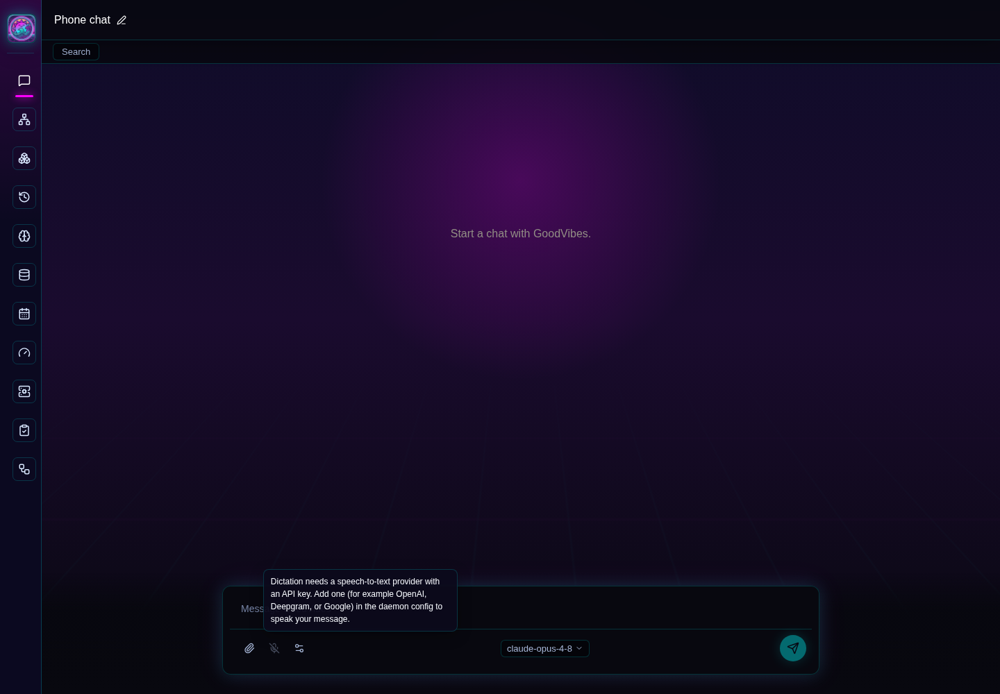

# Screenshot Tour

These screenshots are captured from the WebUI dev server against the
end-to-end suite's seeded mock daemon at `1440x1000`, dark theme. Live auth,
chat history, providers, and daemon state vary by operator environment, so
treat these as layout references rather than fixed data fixtures.

## Chat

Chat is the primary workspace. The composer owns message input, attachment
upload, voice-mode affordances, provider selection, model selection, and send.
The sidebar owns navigation and chat session selection.

## Knowledge/Wiki

Knowledge/Wiki uses the regular GoodVibes Knowledge routes through the scoped
browser Knowledge SDK. Home Assistant Home Graph is intentionally not part of
this general surface.

## Sessions

Sessions is the cross-surface session union: search, read, steer, or follow up
on any session started from the terminal, agent, or browser.

## Fleet

Fleet is the live process tree with per-node steer/detach/stop where the wire
supports them and inline approvals.

## Memory

Memory browses and searches the shared cross-surface memory store with the
recall-honesty details rendered verbatim.

## Calendar

Calendar renders the daemon calendar module's agenda with ICS import/export.

## Providers

Providers is the supporting surface for daemon provider/model state. Provider
selection is provider-first, with model options scoped to the selected provider.

## Admin

Admin contains auth, daemon diagnostics, local auth status, display preferences,
and operational controls that should not clutter Chat.

## Collapsed Sidebar

The collapsed sidebar keeps primary navigation available while giving Chat most
of the horizontal space.

